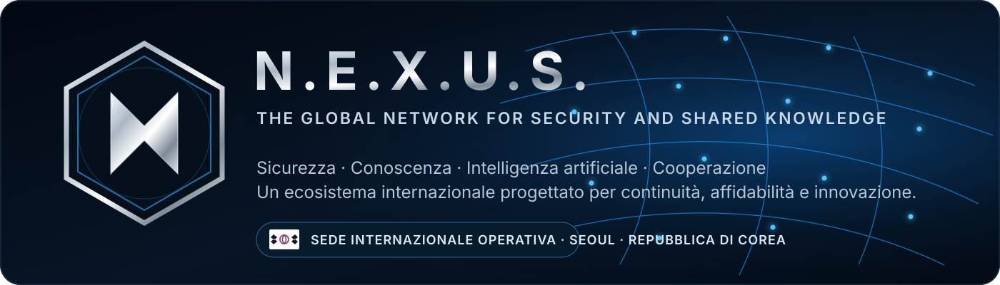

  

<h1 align="center">N.E.X.U.S.</h1>

<strong>The Global Network for Security and Shared Knowledge</strong>

  <strong>🇰🇷 Sede internazionale operativa — Seoul, Repubblica di Corea</strong>

  Ecosistema internazionale dedicato alla sicurezza, alla conoscenza condivisa,
  all’innovazione tecnologica e alla cooperazione interdisciplinare.

---

## Profilo istituzionale

**N.E.X.U.S.** è un ecosistema internazionale concepito per integrare competenze, sistemi e processi ad alto valore all’interno di un’architettura comune, riservata e professionalmente strutturata.
La piattaforma nasce per sostenere lo sviluppo responsabile di tecnologie avanzate, la cooperazione tra discipline differenti e la costruzione di infrastrutture digitali affidabili, modulari e verificabili. Il suo obiettivo è trasformare conoscenza, ricerca e innovazione in capacità coordinate, preservando sicurezza, continuità operativa, responsabilità e controllo.

N.E.X.U.S. rappresenta il livello centrale di un ecosistema progettato per evolvere nel tempo, con una visione internazionale e un’impostazione orientata alla qualità, alla resilienza e alla protezione degli asset strategici.

## Visione

Costruire una rete internazionale capace di connettere persone, competenze e tecnologie attraverso un’infrastruttura comune, progettata per crescere senza rinunciare ad affidabilità, riservatezza e responsabilità.

## Missione

- promuovere conoscenza condivisa e cooperazione interdisciplinare;
- progettare sistemi di intelligenza artificiale affidabili e responsabili;
- sviluppare infrastrutture digitali modulari, sicure e scalabili;
- favorire ricerca applicata, innovazione e integrazione tecnologica;
- proteggere continuità operativa, dati e proprietà intellettuale;
- coordinare strumenti, processi e competenze in un unico quadro strategico.

## Architettura strategica

| Area | Orientamento |
|---|---|
| **Intelligenza artificiale** | Sistemi evoluti, assistenza intelligente, automazione e analisi |
| **Sicurezza** | Protezione dei dati, controllo degli accessi e resilienza operativa |
| **Infrastrutture** | Architetture modulari, integrazioni e servizi distribuiti |
| **Conoscenza** | Organizzazione, condivisione e valorizzazione delle competenze |
| **Cooperazione** | Connessione tra discipline, professionisti e contesti internazionali |
| **Innovazione** | Ricerca applicata, sperimentazione controllata ed evoluzione continua |

## Principi operativi

**Security by design · Privacy by design · Tracciabilità · Modularità · Reversibilità · Verifica continua · Responsabilità**

Ogni componente dell’ecosistema viene concepito secondo criteri di separazione degli ambienti, minimo privilegio, controllo delle modifiche, continuità operativa e protezione degli asset strategici.

## Profilo pubblico e nucleo privato

Questo profilo presenta esclusivamente l’identità pubblica e la visione istituzionale di N.E.X.U.S.

Il codice sorgente, i servizi interni, le applicazioni compilate, le APK, i pacchetti installabili, le configurazioni operative, le credenziali e la documentazione riservata **non sono distribuiti pubblicamente**.

---

  <strong>Dott. Ilario Coppola</strong> 
  Founder & General Supervisor — N.E.X.U.S.

  Knowledge · Security · Technology · Cooperation

